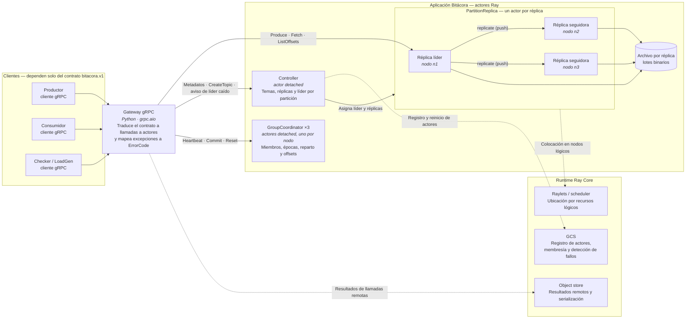
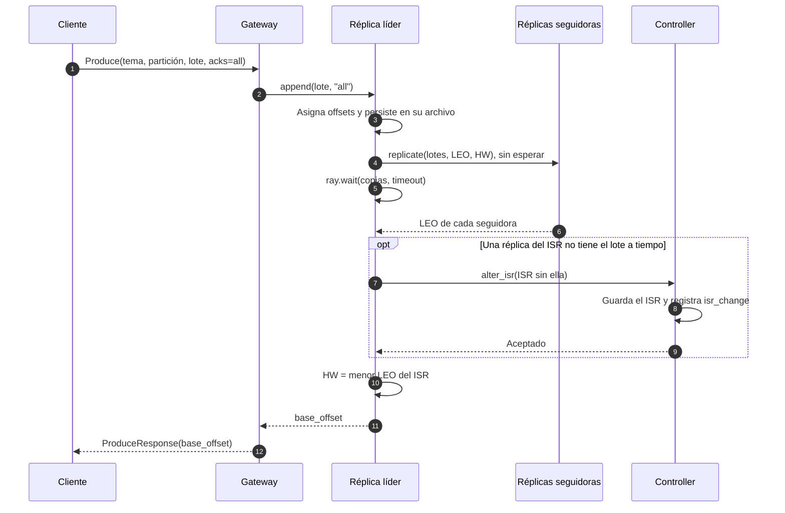
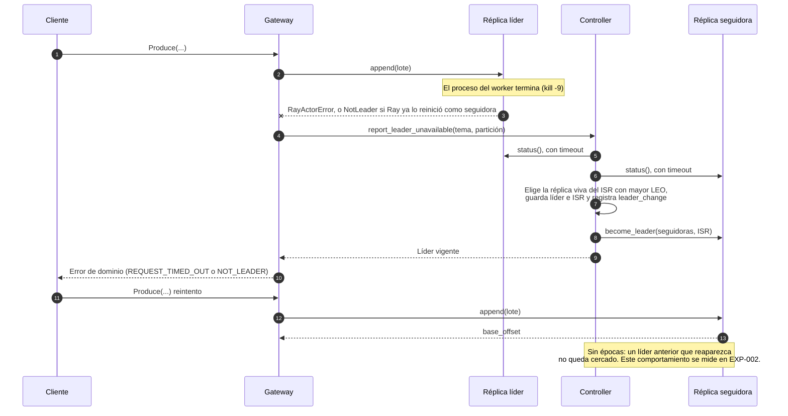

# Fase 1 — Arquitectura del prototipo y dependencias del middleware

| | |
|---|---|
| **Alcance** | Prototipo Python/Ray de Bitácora detrás del contrato gRPC `bitacora.v1` |
| **Estado** | En elaboración; se completa con los resultados de `EXP-001` a `EXP-003` |
| **Requisitos** | RF-01 – RF-09, RNF-09 ([`requirements.md`](../requirements.md)) |
| **Documentos relacionados** | [`contract.md`](../contract.md) · [`exit-gate.md`](exit-gate.md) · [`architecture.md`](../architecture.md) |

## 1. Objetivo y alcance del prototipo

El prototipo implementa el contrato público de Bitácora con el mínimo de
mecanismos propios, apoyándose en las capacidades de Ray Core. Su función es
doble: fijar el comportamiento observable que debe conservar la versión nativa
y registrar qué parte de ese comportamiento proporciona el runtime.

**Incluye:** temas con particiones y réplicas, `Produce` / `Fetch` /
`ListOffsets`, replicación del líder a las réplicas con `acks` configurable,
grupos de consumidores con generación y offsets confirmados, y el gateway
gRPC que expone el servicio.

Incluye también un conjunto de réplicas sincronizadas y un límite de
visibilidad ingenuos: el líder excluye a las réplicas que no responden en plazo
y los consumidores solo leen hasta el límite. No equivalen a la gestión del
conjunto sincronizado de la versión nativa.

**No incluye, de forma deliberada:** idempotencia de productor (los lotes
llevan la identidad a `-1` y `InitProducerId` responde `UNIMPLEMENTED`), épocas
de líder (fencing), autenticación y recuperación con integridad verificada. Su
ausencia es parte del objeto de estudio: los experimentos miden las
consecuencias. El prototipo cumple el perfil básico del contrato
([`contract.md`](../contract.md#perfiles-de-conformidad)).

## 2. Vista de contenedores

El diagrama separa la aplicación (componentes de Bitácora) del runtime del que
depende. Las líneas discontinuas indican dependencia de una capacidad de Ray.

```mermaid
flowchart LR
    subgraph clientes["Clientes — dependen solo del contrato bitacora.v1"]
        prod["Productor<br/>cliente gRPC"]
        cons["Consumidor<br/>cliente gRPC"]
        verif["Checker / LoadGen<br/>cliente gRPC"]
    end

    gw["Gateway gRPC<br/><i>Python · grpc.aio</i><br/>Traduce el contrato a llamadas a actores<br/>y mapea excepciones a ErrorCode"]

    subgraph app["Aplicación Bitácora — actores Ray"]
        ctl["Controller<br/><i>actor detached</i><br/>Temas, réplicas y líder por partición"]
        gc["GroupCoordinator ×3<br/><i>actores detached, uno por nodo</i><br/>Miembros, épocas, reparto y offsets"]
        subgraph parts["PartitionReplica — un actor por réplica"]
            lead["Réplica líder<br/><i>nodo n1</i>"]
            f1["Réplica seguidora<br/><i>nodo n2</i>"]
            f2["Réplica seguidora<br/><i>nodo n3</i>"]
        end
        store[("Archivo por réplica<br/>lotes binarios")]
    end

    subgraph ray["Runtime Ray Core"]
        gcs["GCS<br/>Registro de actores,<br/>membresía y detección de fallos"]
        sched["Raylets / scheduler<br/>Ubicación por recursos lógicos"]
        objs["Object store<br/>Resultados remotos y serialización"]
    end

    prod --> gw
    cons --> gw
    verif --> gw
    gw -->|"Produce · Fetch · ListOffsets"| lead
    gw -->|"Metadatos · CreateTopic · aviso de líder caído"| ctl
    gw -->|"Heartbeat · Commit · Reset"| gc
    ctl -->|"Asigna líder y réplicas"| parts
    lead -->|"replicate (push)"| f1
    lead -->|"replicate (push)"| f2
    lead --> store
    f1 --> store
    f2 --> store

    ctl -.->|"Registro y reinicio de actores"| gcs
    parts -.->|"Colocación en nodos lógicos"| sched
    gw -.->|"Resultados de llamadas remotas"| objs
```

### Componentes

| Componente | Responsabilidad | Estado que posee | Capacidad de Ray de la que depende |
|---|---|---|---|
| Gateway gRPC | Implementa `Log`, `Groups` y `Admin`; localiza los actores, traduce los errores del dominio y los del runtime (`RayActorError`, actor no disponible, plazo vencido) a `ErrorCode`; avisa al `Controller` cuando la líder no responde o ya no es líder; espera en `Fetch` repitiendo la lectura | Caché en memoria de los metadatos de cada tema, que se descarta ante `NOT_LEADER` o un actor que no responde | Localización de actores por nombre; llamadas remotas con futuros |
| `Controller` | Crea temas y reparte réplicas entre nodos lógicos; mantiene líder y conjunto sincronizado por partición; promueve una réplica si el líder falla | Metadatos de temas y particiones | Actor con nombre y ciclo de vida independiente del cliente; reinicio de actores |
| `PartitionReplica` | Añade y lee registros con offsets contiguos; persiste en su archivo; el líder replica a las seguidoras según `acks` | Log de una réplica | Ejecución secuencial de los métodos del actor; ubicación por recursos lógicos |
| `GroupCoordinator` | Tres instancias; cada grupo va a la `crc32(group_id) % 3`. Gestiona entradas, latidos y salidas; reconcilia la asignación de cada miembro con el reparto `range`; valida commits con la época del miembro | Por grupo: época, miembros, asignación actual y offsets | Actor con nombre; ejecución secuencial de sus métodos; un hilo propio solo encola revisiones de plazos |

## 3. Vista de ejecución

### 3.1 Escritura con `acks=all`

```mermaid
sequenceDiagram
    autonumber
    participant C as Cliente
    participant G as Gateway
    participant L as Réplica líder
    participant F as Réplicas seguidoras

    participant K as Controller

    C->>G: Produce(tema, partición, lote, acks=all)
    G->>L: append(lote, "all")
    L->>L: Asigna offsets y persiste en su archivo
    L->>F: replicate(lotes, LEO, HW), sin esperar
    L->>L: ray.wait(copias, timeout)
    F-->>L: LEO de cada seguidora
    opt Una réplica del ISR no tiene el lote a tiempo
        L->>K: alter_isr(ISR sin ella)
        K->>K: Guarda el ISR y registra isr_change
        K-->>L: Aceptado
    end
    L->>L: HW = menor LEO del ISR
    L-->>G: base_offset
    G-->>C: ProduceResponse(base_offset)
```

El líder no aplica un ISR más pequeño hasta que el `Controller` lo ha guardado:
mientras tanto calcula el HW con el anterior. Así, cualquier réplica que el
`Controller` pueda promover tiene todos los lotes confirmados. Si el
`Controller` no responde dentro del plazo, el lote queda escrito en el líder
pero sin confirmar (`REQUEST_TIMED_OUT`); si rechaza el cambio, el líder pasa
a seguidora (`NOT_LEADER`).

Con `acks=1` el líder envía las copias y responde sin esperarlas. Las
respuestas se leen sin bloquear (`ray.wait` con `timeout=0`) al principio de
cada llamada posterior al líder, que es cuando avanza el HW.

### 3.2 Pérdida del proceso que aloja al líder

```mermaid
sequenceDiagram
    autonumber
    participant C as Cliente
    participant G as Gateway
    participant L as Réplica líder
    participant K as Controller
    participant F as Réplica seguidora

    C->>G: Produce(...)
    G->>L: append(lote)
    Note over L: El proceso del worker termina (kill -9)
    L--xG: RayActorError, o NotLeader si Ray ya lo reinició como seguidora
    G->>K: report_leader_unavailable(tema, partición)
    K->>L: status(), con timeout
    K->>F: status(), con timeout
    K->>K: Elige la réplica viva del ISR con mayor LEO,<br/>guarda líder e ISR y registra leader_change
    K->>F: become_leader(seguidoras, ISR)
    K-->>G: Líder vigente
    G-->>C: Error de dominio (REQUEST_TIMED_OUT o NOT_LEADER)
    C->>G: Produce(...) reintento
    G->>F: append(lote)
    F-->>G: base_offset
    Note over K,F: Sin épocas: un líder anterior que reaparezca<br/>no queda cercado. Este comportamiento se mide en EXP-002.
```

La caída se detecta cuando alguien no obtiene respuesta del líder y lo avisa;
el `Controller` lo comprueba por sí mismo antes de promover. Nunca promueve a
una réplica fuera del ISR, porque podría no tener lotes confirmados: si no
responde ninguna del ISR, la partición queda sin líder. Una réplica que Ray
reinicia vuelve siempre como seguidora; solo el `Controller` asigna el papel
de líder.

## 4. Propiedad del estado

| Estado | Propietario | Persistencia | Tras la pérdida o reinicio del propietario |
|---|---|---|---|
| Log de una partición | `PartitionReplica` (una copia por réplica) | Archivo por réplica con los lotes binarios del contrato, uno tras otro | Pendiente de verificar en `EXP-002` |
| Líder, réplicas e ISR por partición | `Controller` | `controller.json`, reescrito de forma atómica (archivo temporal y `os.replace`) antes de comunicar cada cambio | Se conserva tras reiniciar el `Controller` (`test_promotion.py`) |
| Cambios de ISR y promociones | `Controller` | `events.ndjson`, una línea JSON por evento | Solo se añade |
| Papel de cada réplica, LEO de las seguidoras, copias pendientes | `PartitionReplica` líder | Solo en memoria | Se reinicia como seguidora; el `Controller` reasigna los papeles |
| Época, miembros, asignación actual y offsets de cada grupo | `GroupCoordinator` de su fragmento | `group-{id}.json`, escrito de forma atómica antes de responder a cualquier cambio | Se recupera tras `kill -9`; las sesiones vuelven a contar desde el reinicio (`test_group_coordinator.py`) |
| Transiciones de los grupos | `GroupCoordinator` de su fragmento | `group-events-{fragmento}.ndjson`, una línea JSON por evento, escrita después de guardar el grupo | Solo se añade |
| Contadores de latidos, commits, expulsiones y rechazos | `GroupCoordinator` de su fragmento | Solo en memoria (`metrics()`) | Vuelven a cero |
| Identidad del productor | No existe en el prototipo: los lotes la llevan a `-1` | — | No aplica |

## 5. Mapa de dependencias del middleware

Cada fila describe un requisito distribuido, el mecanismo que lo satisface en
el prototipo y la decisión que debe tomar la versión nativa. La columna
*Verificación* referencia la prueba o experimento que confirma el supuesto; una
fila no se da por cerrada sin ella.

| Requisito | Mecanismo en el prototipo | Proporciona | Supuesto o configuración | Verificación | Decisión pendiente en la versión nativa |
|---|---|---|---|---|---|
| Orden dentro de una partición | Los métodos de un actor se ejecutan de uno en uno; el líder asigna los offsets | Ray y Bitácora | Un único llamante serializa las escrituras de la partición | `test_partition_replica.py` (offsets contiguos), `test_replication.py` (las seguidoras conservan los offsets); `EXP-001` y `EXP-002` (I-02 `verified` con 4 escritores concurrentes, también tras la caída de la líder) | Proceso y mecanismo que serializan las escrituras y asignan offsets |
| Invocación remota | Llamadas a métodos de actor desde el gateway | Ray | Argumentos y resultados serializables | `test_gateway.py`; `contracttest/` contra el gateway (13 de 13); `test_partition_replica.py` (los errores llegan con su clase) | Protocolo explícito con plazos e identificadores de petición |
| Estado de una réplica y su recuperación | Lista en memoria más archivo por réplica; reconstrucción desde el archivo al reiniciar | Bitácora y Ray | `max_restarts` configurado | `test_partition_replica.py` (reconstrucción desde el archivo, lote cortado a medias, `kill -9` del actor); `EXP-002` | Propietario del estado y formato durable con detección de corrupción |
| Ubicación de réplicas | Recursos lógicos por nodo y actores con nombre | Ray | Un recurso lógico por nodo simulado | `test_multinode.py` (cada copia en un nodo Ray distinto), `test_controller.py` (reparto en anillo) | Asignación determinista frente a planificación dinámica |
| Descubrimiento de componentes | Localización de actores por nombre | Ray | Actores `detached` registrados | `test_controller.py` (una réplica con nombre por copia; sobreviven a quien las creó; el `Controller` recuerda los temas tras morir) | Arranque desde semillas y metadatos servidos por el clúster |
| Membresía y detección de fallos | Detección de muerte de procesos por el runtime | Ray | Cada réplica en un proceso distinto | `test_promotion.py`, `test_group_coordinator.py` (expulsión de un miembro en silencio); `EXP-002` (Ray tarda ~1,9 s en dar el proceso por muerto) | Latidos, sesiones y criterio de sospecha |
| Elección o promoción de líder | Quien no obtiene respuesta avisa al `Controller`, que comprueba el líder con un plazo y promueve la réplica viva del ISR con mayor LEO | Bitácora | Sin épocas ni cercado; sin latidos periódicos | `test_promotion.py`; `EXP-002` (promoción en ~1,9 s; L-01 sin poner a prueba) | Elección entre réplicas sincronizadas con época y rechazo de líderes obsoletos |
| Reintento ante fallo | `max_task_retries` del actor | Ray | Se ejecutan 0 y 3 reintentos | `EXP-002` (0: sin segundo efecto), `EXP-003` (3: segundo efecto en 4 de 5 caídas) | Identidad de productor, secuencia y deduplicación en el líder |
| Replicación | El líder envía los lotes a las seguidoras (`replicate`) y espera con `ray.wait` y un plazo; el ISR lo cambia el `Controller` a propuesta del líder | Bitácora y Ray | Replicación por *push*; `acks=all` espera a las réplicas del ISR; plazo `BITACORA_REPLICATION_TIMEOUT_MS` | `test_replication.py` | Replicación por *pull*, conjunto sincronizado y límite de visibilidad |
| Resultado de una operación remota | Respuesta síncrona con el offset base | Ray | Sin almacén de resultados propio | `test_gateway.py` (ida y vuelta), `contracttest/`; `EXP-001` (ningún `offset_mismatch` en ~173 000 escrituras) | Respuesta síncrona con el offset; sin object store |
| Coordinación de grupos | Tres actores coordinadores; reconciliación incremental por latidos; asignación `range`; offsets en archivo por grupo | Bitácora | Fragmento fijo por `crc32`; un hilo por actor modifica el estado | `test_group_coordinator.py`, `test_range_strategy.py` | Coordinador y offsets replicados mediante consenso |
| Serialización entre procesos | Serialización del runtime | Ray | Registros como bytes | `test_errors.py` (los errores sobreviven a pickle), `test_batch_vectors.py` e `internal/record` (los mismos lotes en Python y Go) | Formato de cable Protobuf y formato binario en disco |
| Control de carga | Cola de llamadas pendientes del actor | Ray | Sin límite explícito | `test_partition_replica.py` (sin `max_pending_calls`: 1000 llamadas simultáneas se aceptan y se ejecutan de una en una) | Colas acotadas, plazos y presupuesto de reintentos |
| Observabilidad | Eventos estructurados de la aplicación y estado del runtime | Bitácora y Ray | Eventos JSON del `Controller` (`events.ndjson`: cambios de líder e ISR) y de los coordinadores (transiciones y métricas); sin identificadores de petición | `test_group_coordinator.py` (transiciones en orden y métricas); `EXP-002` y `EXP-003` (`nodes/events.ndjson`) | Logs estructurados con identificadores estables y métricas |

## 6. Resultados observados

Se actualiza al cerrar cada experimento. Cada hallazgo enlaza su registro en
`evidence/phase-1-ray/` y declara el estado de los invariantes del problema
([`requirements.md`](../requirements.md#invariantes-del-problema)) que el
experimento pone a prueba: `verified`, `violated` o `not_evaluable`.

| Experimento | Escenario | Invariantes evaluados | Predicción | Resultado | Implicación para el diseño nativo |
|---|---|---|---|---|---|
| `EXP-001` | Línea base sin fallos (`F0`) | I-01, I-02, I-03 | Todas `verified`; 500–800 ok/s con `acks=all` ([registro](../../evidence/phase-1-ray/EXP-001-baseline/record.md)) | Como se predijo: todas `verified`; ~720 ok/s con `acks=all` (p99 ≤ 9,3 ms) y ~1 200 con `acks=leader`; sin fallos, ningún intervalo sin escrituras `ok` supera 33 ms | Línea base de la Fase 3 en esta máquina (L-04) |
| `EXP-002` | Pérdida del worker del líder, sin reintentos (`F15`) | I-02, I-03, I-04 | `verified`; 1–6 s sin escrituras `ok` ([registro](../../evidence/phase-1-ray/EXP-002-leader-worker-loss/record.md)) | Todas `verified` en 8 ejecuciones; 1,93–1,97 s sin escrituras `ok`, marcados por la detección de Ray; las 4 escrituras en curso, `indeterminate`; ninguna `fail` | Detectar la caída de la líder con latidos y plazos propios (L-06), no con el runtime |
| `EXP-003` | Pérdida del worker del líder, con reintentos (`F15`) | I-02, I-03, I-08 | I-08 `verified` casi siempre; duplicado posible si la réplica reiniciada vuelve a ser líder antes del reintento ([registro](../../evidence/phase-1-ray/EXP-003-leader-worker-loss-retries/record.md)) | I-08 `violated` en 4 de 5: 3 escrituras rechazadas presentes en el log (L-14) y 1 duplicado confirmado con `ok`, que también rompe I-02; I-03 e I-04 `verified` | Identidad de productor con secuencia y deduplicación en la líder; ningún reintento de operaciones con efecto en el runtime |

## 7. Limitaciones y riesgos conocidos

| ID | Descripción | Consecuencia esperada | Medida |
|---|---|---|---|
| L-01 | No hay épocas de líder | Un líder anterior puede aceptar escrituras tras una promoción | `EXP-002` no lo pone a prueba: tras un `kill -9` no queda líder antigua viva. Requiere un experimento con la líder pausada o aislada; se resuelve en la versión nativa |
| L-02 | Los reintentos del runtime no distinguen operaciones con efecto | Registros duplicados o escrituras rechazadas que sí tuvieron efecto con `max_task_retries` > 0 | Medido en `EXP-003` (4 de 5 caídas); el prototipo usa 0; se resuelve con idempotencia de productor, del perfil completo del contrato |
| L-03 | La replicación *push* no regula el ritmo de las seguidoras | Una réplica lenta retrasa la confirmación | Documentar el plazo configurado y su efecto |
| L-04 | Todos los nodos lógicos comparten una máquina | Los resultados cubren fallo de proceso, no de host | Declararlo en cada conclusión experimental |
| L-05 | El estado en memoria de un actor se pierde si no se ha persistido | Pérdida de metadatos o de registros no volcados | `EXP-002`: ninguna escritura confirmada perdida tras `kill -9` (escritura con `flush`); no cubre la caída del sistema sin `fsync` |
| L-06 | La caída del líder solo se detecta cuando alguien le llama y lo avisa | Una partición sin tráfico puede tener un líder caído sin que se promueva otro | Aceptado en el prototipo; la versión nativa usa latidos y sesiones |
| L-07 | Mientras el líder espera a las seguidoras no atiende otras llamadas | Una seguidora lenta retrasa también las lecturas, hasta el plazo | Documentar el plazo configurado; medir latencias en `EXP-001` |
| L-08 | Con `acks=1`, el HW solo avanza cuando llega otra llamada al líder | Un lote puede tardar en ser visible si no hay más tráfico | Aceptado en el prototipo |
| L-09 | Los coordinadores de grupo comparten la carpeta de datos | Solo funciona con todos los nodos lógicos en una máquina | Aceptado en el prototipo; la versión nativa replica el estado |
| L-10 | El número de fragmentos de grupo es fijo | Cambiarlo movería los grupos de coordinador | Fijarlo antes del despliegue |
| L-11 | La expulsión por plazo vencido puede retrasarse hasta un segundo | Un miembro caído conserva sus particiones hasta el siguiente tic | Aceptado: es pequeño frente a la sesión de 10 s |
| L-12 | `Fetch` espera repitiendo la lectura cada 50 ms en el gateway: el actor de la réplica no puede quedarse esperando sin bloquear su partición | Latencia extra de hasta 50 ms al llegar datos y una llamada a la líder por intervalo y consumidor en espera | Aceptado en el prototipo; la versión nativa avisa a los lectores cuando avanza el HW |
| L-13 | El gateway es un único proceso y el único punto de entrada | Si cae, ningún cliente llega al clúster aunque los actores sigan vivos | Aceptado en el prototipo; en la versión nativa cada nodo atiende el contrato |
| L-14 | En `Produce`, el gateway traduce `NotLeader` a `NOT_LEADER` («sin efecto»), lo que solo es cierto si la llamada se ejecutó una vez | Con `max_task_retries` > 0, Ray repite un `append` interrumpido en la réplica reiniciada; su `NotLeader` oculta que el primer intento ya escribió, y el cliente cree rechazada una escritura que está en el log | El prototipo usa `max_task_retries=0`; medirlo en `EXP-003`; la versión nativa necesita identidad de productor y no reintentar operaciones con efecto en el runtime |
